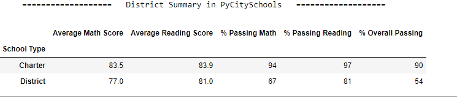

# School District Analysis Project

## Overview of the School District Analysis
The School District Analysis is a analysis that based on the current year data to help the district determine how much money should be allocated to and spent on each school. 

## Overview of Project
Using the given data, the analyst was able to clean, aggregate, and calculate the data using Panda’s Series and Data Frame with various functions Panda library provided to obtain valuable numbers for the school board outcome of the board spending and possibly to budget efficiently for the upcoming year.

### Purpose
<b>To help the school board to set the budget for the upcoming school year by summarizing current year data by each district’s performance and its outcome of the current year.</b>
	
	
## Analysis and Challenges
The data was cleaned and accurately measured based on the budget spending for the current year.  However, the shool board found one of the high school gave them a wrong data, which later removed the wrong data being included in analysis, and ran over the analysis again after the correction.   

The most challenging part was, it was asked to add more functionalities, which made a long lingering process, which the developer wasn’t used to although the nature of the Jupyter Notebook being segmentizing the code helped a lot in the process.  It would be better if we had functions defined ahead and call one when it was necessary to call. 

### Analysis of Outcomes Based on Goals
It was quite a jouney, but ultimately met a goal where the developer was able to report summaries of what has been asked.

### Challenges and Difficulties Encountered
It was difficult to find a function that is suitable for the imagination.  Sometimes finding the right function took more than coding and had to justify it as a learning process.  However, in the end, it was a great feeling going through the journey again.  Many methods, such as isnull() counts or split() strip() were already forgotten at the end of the project, and redoing the projects reminded a lot of it, although it looked like brand new information.

- How is the district summary affected?
#### The data showed no differences before / after the Thomas High School's Scores Correction (see below)

-District Summary in PyCitySchools Before Thomas High School Score Correction

-District Summary in PyCitySchools After Thomas High School Score Correction

- How is the school summary affected?
#### The Thomas High School's Scores Correction made slightly different math/Reading on scores and Average scores. (see below)
However there wasn't much differences in ratings.  The Thomas High School still remained #2 among other schools.

School Summary in PyCitySchools Before Thomas High School Score Correction

School Summary in PyCitySchools After Thomas High School Score Correction

- How does replacing the ninth graders’ math and reading scores affect Thomas High School’s performance relative to the other schools?
#### The data showed there wasn't much differences in the scores although the actual calcuation excluded nith graders as an NaN. 
#### Still the Thomas High School still remained #2 among other schools. (see above sorted list)

## Summary
  <li> Each school should keep their data accurately to prevent Thomas High School incident.</li>
  <li> Luckily even though Thomas High School 9th grades were dropped, overall school performance was great. </li>
  <li> Medium sized schools performed better than small or large sized schools. </li>
  <li> The Charter schools performed better than the district schools. </li>
